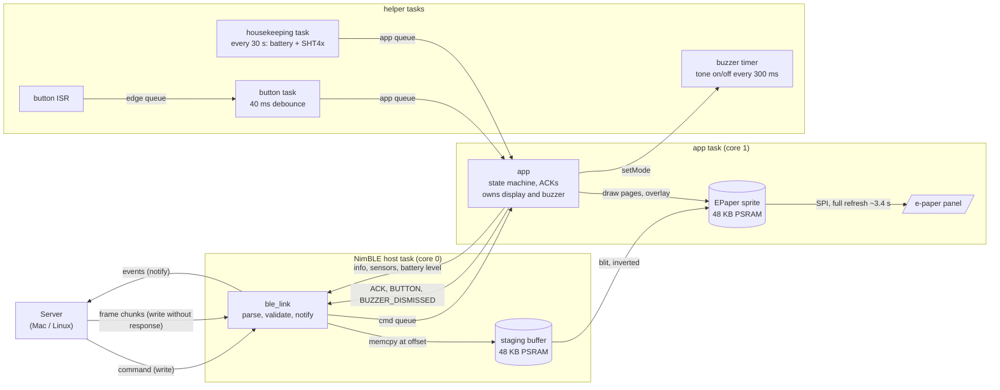
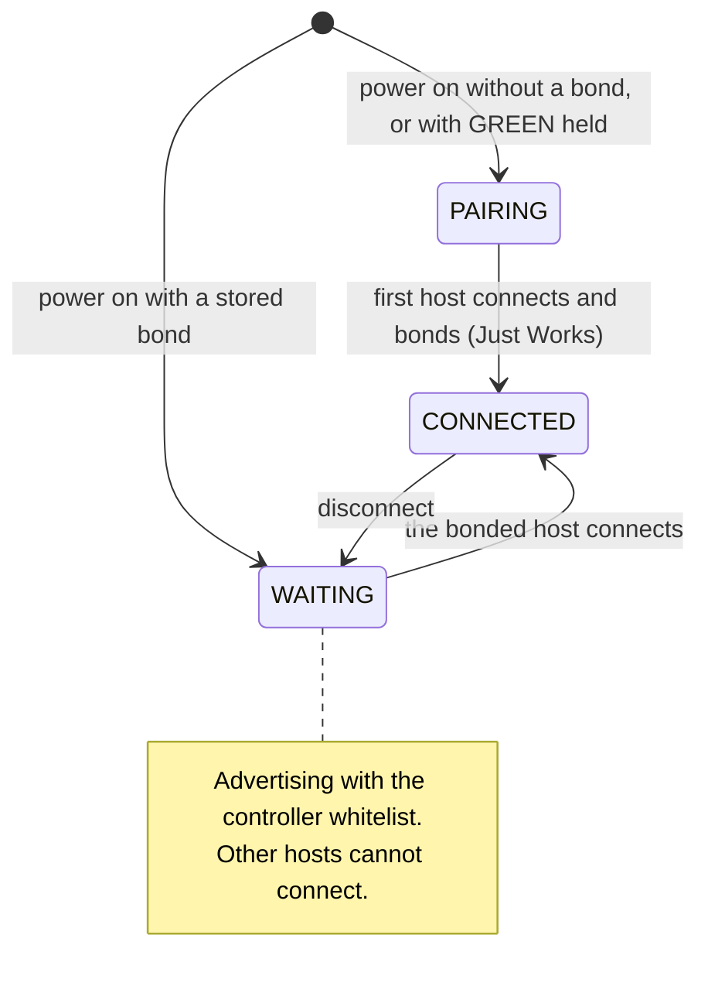
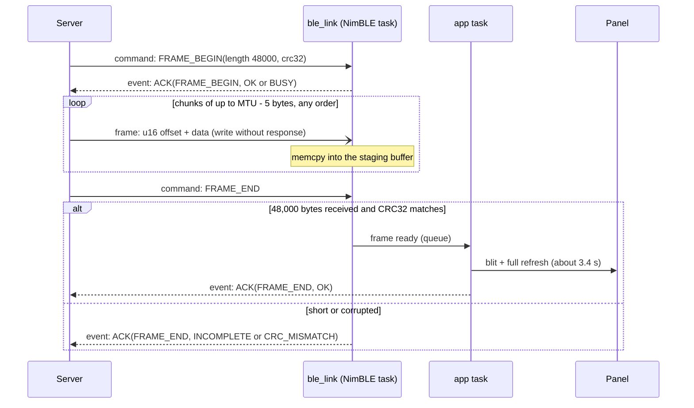

# Prelude Terminal

Firmware that turns a [Seeed reTerminal E1001](https://wiki.seeedstudio.com/getting_started_with_reterminal_e1001/)
into a dumb Bluetooth Low Energy display terminal. A server on a Mac or Linux
box connects, pushes full-screen frames and short status messages, and
controls the buzzer. The device reports button presses, buzzer dismissal,
battery level and sensor readings.

| | |
|---|---|
| Board | reTerminal E1001: ESP32-S3, 8 MB PSRAM, 32 MB flash |
| Panel | 7.5" 800×480 monochrome e-paper, full refresh ≈ 3.4 s |
| Inputs | LEFT, RIGHT, GREEN buttons |
| Outputs | passive buzzer, status LED |
| Sensors | SHT4x temperature/humidity, battery voltage |
| Radio | BLE only (the ESP32-S3 has no classic Bluetooth) |
| Power | 2000 mAh battery, no deep sleep |

## Contents

- [Build, flash, monitor](#build-flash-monitor)
- [Architecture](#architecture)
- [Pairing and screens](#pairing-and-screens)
- [Talking to the device](#talking-to-the-device)
  - [Getting information from the device](#getting-information-from-the-device)
  - [Sending information to the device](#sending-information-to-the-device)
  - [Python example](#python-example)
- [Probe tool](#probe-tool)
- [Tests and verification](#tests-and-verification)
- [Repository layout](#repository-layout)

## Build, flash, monitor

PlatformIO project, Arduino framework, Seeed platform.

    pio run -e reterminal_e1001                 # build
    pio run -e reterminal_e1001 -t upload       # flash over USB-C
    pio device monitor -e reterminal_e1001      # logs, 115200 baud
    pio test -e native                          # host unit tests

Notes:

- The USB-C port is a CH340 USB-serial bridge wired to UART0 (GPIO 43/44),
  not the ESP32-S3's native USB. Logs therefore go to `Serial0` (see
  `src/log.h`). Uploads run at 115200 baud; faster rates make the chip stop
  responding through the bridge.
- If the Homebrew `pio` fails building the bootloader with
  `No module named 'intelhex'`, use PlatformIO's own interpreter:
  `~/.platformio/penv/bin/pio ...`.

## Architecture

The firmware is split into a pure C++ core that is unit-tested on the host,
thin hardware wrappers, and one application task that owns all mutable
state. BLE callbacks never block: they validate, copy bytes, and hand work to
the app task through a FreeRTOS queue. The slow e-paper refresh only ever
blocks the app task, so buttons, buzzer and BLE stay responsive.



| Module | Responsibility |
|---|---|
| `lib/protocol/prelude/` | Opcodes, command/event codec, CRC32, frame assembler, sensor TLV, SHT4x decoding, battery curve, button policy, buzzer pattern, word wrap. No Arduino headers; tested with Unity on `platform = native`. |
| `src/app.*` | The state machine (PAIRING / WAITING / CONNECTED), command dispatch, ACKs, button policy, "server owns the screen" rule, housekeeping sampling. Sole caller of `display` and `buzzer`. |
| `src/ble_link.*` | NimBLE service and characteristics, Just Works bonding, lock to the first host (controller whitelist plus an application check), frame staging, notifications. |
| `src/display.*` | Seeed_GFX `EPaper` wrapper: pairing page, status strip, overlay box, raw 1-bit blit. |
| `src/buttons.*` | Falling-edge interrupts, 40 ms debounce, one event per press. |
| `src/buzzer.*` | 2 kHz tone, 300 ms on / 300 ms off, driven by a FreeRTOS software timer. |
| `src/battery.*` | GPIO21 enable, ADC on GPIO1, ×2 divider, 8-sample average. |
| `src/sensors.*` | SHT4x over raw I2C (0x44 on GPIO 19/20). |
| `tools/prelude_probe.py` | bleak-based dev client and the reference for the server side. |

Frame path in detail: `FRAME_BEGIN` opens the staging buffer; each chunk
write is a `memcpy` at its offset; `FRAME_END` checks that exactly 48,000
bytes arrived and that the CRC32 matches, then the app task copies the
buffer into the sprite (inverting, because the panel uses 1 = white) and
refreshes. The ACK for `FRAME_END` is sent after the refresh, so it doubles
as "render done".

## Pairing and screens

The device advertises as `Prelude-XXXX` (last two bytes of its Bluetooth
address). Pairing is Just Works: no PIN, the first host that connects bonds
and becomes the only host allowed to connect. Hold **GREEN while powering
on** to clear the bond.

Device-rendered page (shown until the server sends its first frame):

```
+--------------------------------------------------------+
|  Prelude Terminal                            [fw 0.1.0] |
|  Seeed Studio e1001                                     |
|  Connect to Bluetooth device "Prelude-XXXX"             |
|  Hold the green button while powering on to unpair      |
|                                                         |
| [ <status>                                      87% ▮ ] |
+--------------------------------------------------------+
```



| State | Status line |
|---|---|
| no bond | `Bluetooth Pairing...` |
| bonded, not connected | `Paired with AA:BB:CC:DD:EE:FF, waiting for connection...` |
| connected | `Connected! Waiting for data...` |

Once a frame has been rendered the server owns the screen: connects,
disconnects and battery changes no longer redraw anything, and the last frame
stays on the panel (e-paper keeps it without power) until the next command.

## Talking to the device

Service UUID `7e1d0000-6b6f-4a6b-9f1a-5072656c7564`. Every characteristic
below requires an encrypted link, which is what makes macOS and BlueZ pair
automatically on first access. Multi-byte integers are little-endian.

| Characteristic | UUID | Properties |
|---|---|---|
| info | `7e1d0001-6b6f-4a6b-9f1a-5072656c7564` | read |
| command | `7e1d0002-6b6f-4a6b-9f1a-5072656c7564` | write with response |
| frame | `7e1d0003-6b6f-4a6b-9f1a-5072656c7564` | write without response |
| event | `7e1d0004-6b6f-4a6b-9f1a-5072656c7564` | notify |
| sensors | `7e1d0005-6b6f-4a6b-9f1a-5072656c7564` | read |

Plus the standard Battery Service `0x180F` with Battery Level `0x2A19`
(read + notify).

### Getting information from the device

**Subscribe to `event` first.** ACKs and button presses are notifications;
nothing is sent to a host that has not subscribed. Each notification starts
with a type byte:

| Type | Name | Payload |
|---|---|---|
| 0x01 | BUTTON | `u8 id`: 0 LEFT, 1 RIGHT, 2 GREEN |
| 0x02 | BUZZER_DISMISSED | none (GREEN pressed while the buzzer was dismissable) |
| 0x03 | ACK | `u8 opcode`, `u8 status` |

ACK status: 0 OK, 1 BAD_ARG, 2 BUSY, 3 CRC_MISMATCH, 4 INCOMPLETE. Button
presses while no host is connected are dropped.

**Read `info`** (11 bytes, struct format `<BBBBHHBH`):

```
u8  protocol_version   (1)
u8  fw_major, fw_minor, fw_patch
u16 width  (800)
u16 height (480)
u8  battery_percent
u16 battery_mv
```

**Read `sensors`**: a list of `[u8 type][u8 len][value]` records, refreshed
every 30 s. Records for hardware that was not detected at boot are omitted,
so the list also tells you what the device has.

| Type | Sensor | len | Value |
|---|---|---|---|
| 0x01 | SHT4x temperature | 2 | `int16` centi-°C |
| 0x02 | SHT4x humidity | 2 | `uint16` centi-%RH |
| 0x03 | Battery | 3 | `u8 percent`, `u16 mV` |

**Battery Level `0x2A19`**: one byte, percent. Subscribe to get a
notification whenever the housekeeping sample changes.

### Sending information to the device

Write one command per write to `command` (with response). The first byte is
the opcode:

| Opcode | Name | Payload | ACK sent |
|---|---|---|---|
| 0x01 | DISPLAY_STATUS | UTF-8 text, 1..500 bytes | after the refresh |
| 0x02 | FRAME_BEGIN | `u32 length` (48000), `u32 crc32` | immediately |
| 0x03 | FRAME_END | none | after the refresh |
| 0x10 | BUZZER_OFF | none | immediately |
| 0x11 | BUZZER_ON | none | immediately |
| 0x12 | BUZZER_ON_DISMISSABLE | none | immediately |

- **DISPLAY_STATUS** draws a centered 560×240 box over whatever is on
  screen, word-wrapped, at most 6 lines. The next frame or status replaces
  it.
- **BUZZER_ON** beeps 300 ms on / 300 ms off until BUZZER_OFF or
  disconnect. **BUZZER_ON_DISMISSABLE** does the same but a GREEN press
  silences it and reports BUZZER_DISMISSED instead of BUTTON.
- A full command queue answers `ACK(opcode, BUSY)`; retry.

**Sending a frame.** Image format: 800×480, 1 bit per pixel, row-major,
100 bytes per row, MSB is the leftmost pixel, **1 = black**. 48,000 bytes.



1. Write `FRAME_BEGIN(48000, crc32)` and wait for `ACK(0x02, OK)`. `BUSY`
   means the previous frame is still being received or rendered.
2. Write chunks to `frame` without response: `u16 offset` followed by data.
   Any order, any size up to MTU − 5 bytes (510 with MTU 515).
3. Write `FRAME_END` and wait for `ACK(0x03, ...)`: `OK` once the panel has
   refreshed, otherwise `INCOMPLETE` (byte count ≠ 48,000) or
   `CRC_MISMATCH`.
4. Only then start the next frame. A frame left open for 10 s is discarded.

A frame takes about 2–3 s to transfer and 3.4 s to refresh.

**macOS caveat.** CoreBluetooth silently discards write-without-response
packets queued while `canSendWriteWithoutResponse` is false, and bleak does
not wait for it. Poll that flag before each chunk (as the example and the
probe do); otherwise roughly half the chunks are lost and the device answers
`INCOMPLETE`. BlueZ queues writes and needs no such care.

### Python example

Requires `bleak` and `pillow` (`pip install -r tools/requirements.txt`,
Python 3.11+ on macOS). Scans for the device, reads info and sensors, shows
a status message, pushes a frame, then prints button events for 20 s.

```python
import asyncio, struct, zlib
from bleak import BleakClient, BleakScanner
from PIL import Image, ImageDraw

SVC     = "7e1d0000-6b6f-4a6b-9f1a-5072656c7564"
INFO    = "7e1d0001-6b6f-4a6b-9f1a-5072656c7564"
COMMAND = "7e1d0002-6b6f-4a6b-9f1a-5072656c7564"
FRAME   = "7e1d0003-6b6f-4a6b-9f1a-5072656c7564"
EVENT   = "7e1d0004-6b6f-4a6b-9f1a-5072656c7564"
SENSORS = "7e1d0005-6b6f-4a6b-9f1a-5072656c7564"

DISPLAY_STATUS, FRAME_BEGIN, FRAME_END, BUZZER_OFF, BUZZER_ON = 0x01, 0x02, 0x03, 0x10, 0x11
BUTTONS = {0: "LEFT", 1: "RIGHT", 2: "GREEN"}
acks = asyncio.Queue()


def on_event(_, data):
    if data[0] == 0x01:
        print("button:", BUTTONS[data[1]])
    elif data[0] == 0x02:
        print("buzzer dismissed")
    elif data[0] == 0x03:
        acks.put_nowait((data[1], data[2]))       # (opcode, status)


async def command(client, payload, timeout=20):
    """Write one command and wait for its ACK. Status 0 is OK."""
    await client.write_gatt_char(COMMAND, payload, response=True)
    opcode, status = await asyncio.wait_for(acks.get(), timeout)
    return status


def make_frame():
    """Any 800x480 picture -> 48,000 packed bytes with 1 = black."""
    img = Image.new("L", (800, 480), 255)
    d = ImageDraw.Draw(img)
    d.rectangle([40, 40, 760, 440], outline=0, width=6)
    d.text((80, 200), "Hello from Python", fill=0)
    packed = img.point(lambda p: 255 if p >= 128 else 0, mode="1").tobytes()  # PIL packs 1 = white
    return bytes(~b & 0xFF for b in packed)


async def send_frame(client, frame):
    status = await command(client, struct.pack("<BII", FRAME_BEGIN, len(frame), zlib.crc32(frame)))
    assert status == 0, f"frame_begin refused with status {status}"
    chunk = client.mtu_size - 5
    periph = getattr(getattr(client, "_backend", None), "_peripheral", None)   # macOS only
    for off in range(0, len(frame), chunk):
        while periph is not None and not periph.canSendWriteWithoutResponse():
            await asyncio.sleep(0.001)                                            # macOS back-pressure
        await client.write_gatt_char(FRAME, struct.pack("<H", off) + frame[off:off + chunk], response=False)
    return await command(client, bytes([FRAME_END]), timeout=30)                 # OK once refreshed


async def main():
    found = await BleakScanner.discover(timeout=8, return_adv=True)
    device = next(d for d, adv in found.values() if SVC in adv.service_uuids)

    async with BleakClient(device) as client:
        await client.start_notify(EVENT, on_event)           # subscribe before sending anything

        proto, major, minor, patch, w, h, pct, mv = struct.unpack("<BBBBHHBH", await client.read_gatt_char(INFO))
        print(f"firmware {major}.{minor}.{patch}, {w}x{h}, battery {pct}% ({mv} mV)")

        raw = await client.read_gatt_char(SENSORS)
        i = 0
        while i < len(raw):
            t, n, value = raw[i], raw[i + 1], raw[i + 2:i + 2 + raw[i + 1]]
            i += 2 + n
            if t == 0x01: print("temperature", struct.unpack("<h", value)[0] / 100, "C")
            if t == 0x02: print("humidity", struct.unpack("<H", value)[0] / 100, "%RH")

        print("status ->", await command(client, bytes([DISPLAY_STATUS]) + "Hello from Python".encode()))
        print("frame  ->", await send_frame(client, make_frame()))
        print("buzzer ->", await command(client, bytes([BUZZER_ON])))
        await asyncio.sleep(2)
        await command(client, bytes([BUZZER_OFF]))

        print("press some buttons (20 s)...")
        await asyncio.sleep(20)

asyncio.run(main())
```

## Probe tool

`tools/prelude_probe.py` wraps the same protocol in a CLI:

    python3 -m venv .venv && .venv/bin/pip install -r tools/requirements.txt
    .venv/bin/python tools/prelude_probe.py scan
    .venv/bin/python tools/prelude_probe.py info
    .venv/bin/python tools/prelude_probe.py sensors
    .venv/bin/python tools/prelude_probe.py listen
    .venv/bin/python tools/prelude_probe.py status "Hello world"
    .venv/bin/python tools/prelude_probe.py frame --test        # checkerboard
    .venv/bin/python tools/prelude_probe.py frame picture.png
    .venv/bin/python tools/prelude_probe.py buzzer on|dismissable|off

macOS caches peripheral names, so a board that previously ran other firmware
may show its old name in Bluetooth tools; the probe matches on the
advertised name and service UUID instead.

## Tests and verification

Host tests (`pio test -e native`, 31 tests): codec round-trips and
rejections, frame assembly with out-of-order chunks, CRC, BUSY and timeout
handling, battery curve, button policy, buzzer pattern, sensor TLV, SHT4x
CRC and conversion, word wrap.

Verified on a reTerminal E1001 paired to a Mac (2026-09-07): pairing and
bonding, whitelisted reconnect, status overlay, full frames (48,000 bytes in
about 2 s, refresh 3.4 s, polarity correct), button events, dismissable
buzzer with GREEN, buzzer stopping on disconnect.

Manual checklist for a new build:

1. Fresh flash → pairing page with `Bluetooth Pairing...` and battery.
2. `prelude_probe.py info` → pairing prompt once, page flips to
   `Connected! Waiting for data...`.
3. `status "Hello"` → overlay box. `frame --test` → checkerboard with the
   top-left square black.
4. `listen` and press LEFT/RIGHT/GREEN → BUTTON events.
5. `buzzer dismissable` → GREEN silences it and sends BUZZER_DISMISSED;
   `buzzer on` → GREEN is a plain BUTTON and beeping continues.
6. Disconnect → buzzer stops, screen unchanged, a second computer cannot
   connect.
7. Power-cycle holding GREEN → `Pairing cleared`, then `Bluetooth Pairing...`.

## Repository layout

```
platformio.ini             board env (reterminal_e1001) + host test env (native)
include/version.h          firmware and protocol version
lib/board/board_pins.h     pin map
lib/protocol/prelude/      pure protocol + policy code (host-tested)
src/                       app, ble_link, display, buttons, buzzer, battery, sensors
test/                      Unity suites for lib/protocol
tools/prelude_probe.py     bleak-based dev client
```
